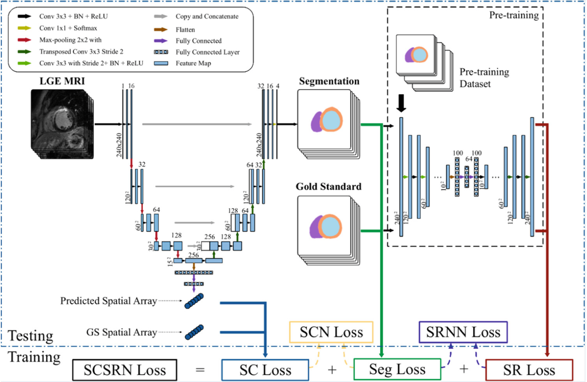

# LGE-CMR segmentation
This is a PyTorch implementation of the MICCAI paper by Qian Yue et al. on LGE-CMR segmentation. UNet, SRNN, SCN and SRSCN are performed for the segmentation task.

## Introduction
Automatic cardiac segmentation from LGE-CMR is of great clinical value. In [3], Yue et al. proposed SRSCN, a U-Net based method incorporating  additional modules for shape reconstruction and spatial constraint. The pipeline from their paper summarizes the model. For more details, please refer to [3].


## Training
In this project, we trained the basic UNet, SRNN, SCN and SRSCN on  [MSCMR](http://www.sdspeople.fudan.edu.cn/zhuangxiahai/0/mscmrseg19/data.html) dataset, which is available upon registration. 

```
python main.py --path "data_path" --batch_size 8 --dim 240 --lr 1e-4 --threshold 0.65 --end_epoch 30
```
The deta path is organized as follows:
```
data/
  -- image files & gt files
  -- train.txt (with each line: image_path gd_path z_index)
  -- validation.txt (with each line: image_path gd_path z_index)
  -- test.txt (with each line: image_path dx dy dz)
```
Pretrained models with bathsize = 8 and epoch = 30 are stored in `checkpoints/model_name`. 

## Prediction
To use the models for segmentation, please prepare `test.txt` in the data path as descibed above and type:

```
python predict.py --load_path checkpoints/"model name" --predict_mode multiple --threshold 0.6 --dim 240
```

## Citations
[1]Xiahai Zhuang: Multivariate mixture model for myocardial segmentation combining multi-source images. IEEE Transactions on Pattern Analysis and Machine Intelligence 41(12), 2933–2946, 2019 

[2]Xiahai Zhuang: Multivariate mixture model for cardiac segmentation from multi-sequence MRI. MICCAI 2016, 581–588, Springer, 2016 

[3]Q Yue, X Luo, Q Ye, L, Xu, X Zhuang. Cardiac Segmentation from LGE MRI Using Deep Neural Network Incorporating Shape and Spatial Priors. MICCAI 2019, LNCS 11765, pp. 559-567, 2019.
	https://github.com/xzluo97/LGE_SRSCN
